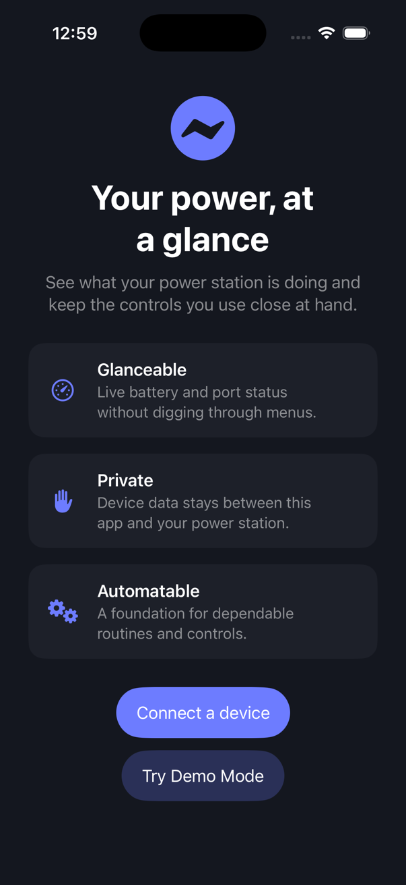
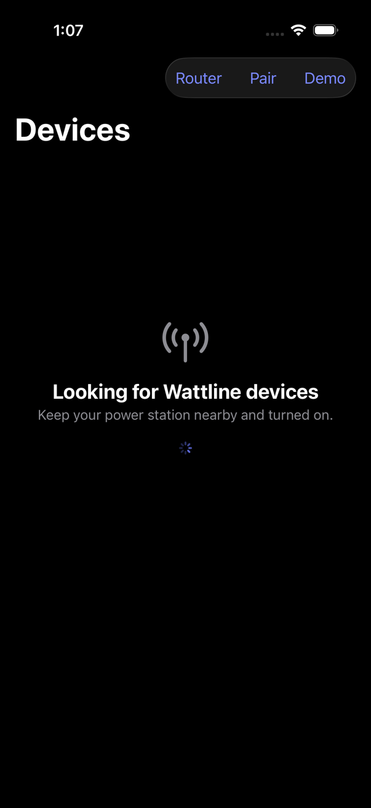
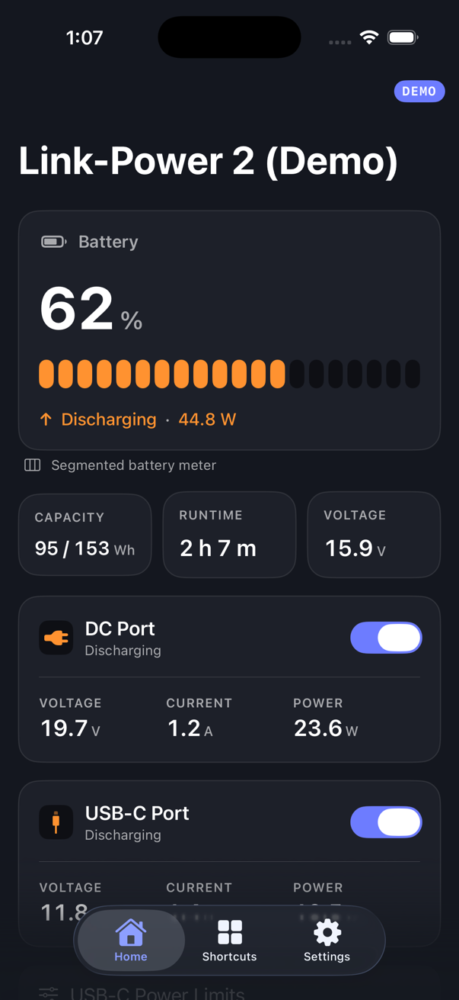

# Wattline

Wattline is an iPhone, iPad, and Mac companion for compatible power devices.

## Quick Start

1. Install and open Wattline.
2. Choose **Connect a device** and allow Bluetooth access when asked.
3. Turn on the power station and keep it nearby.
4. Choose it under **Nearby devices**.
5. Use the dashboard to view live power and port status.

## Bluetooth is the everyday connection

Wattline connects directly to your power device over Bluetooth Low Energy.
You do not need a router or cloud account to discover, connect to, and use a
nearby device.

Bluetooth permission lets Wattline look for compatible devices in range. If
you do not see your device under **Nearby devices**, make sure Bluetooth is
enabled, the power station is on and close by, and then return to **Connect a
device** to scan again.

## Screenshots

For the reproducible capture procedure, see [the screenshot guide](docs/screenshots.md).

## Troubleshooting

- **Bluetooth access was denied:** Enable Bluetooth access for Wattline in your
  device settings, then reopen the app and choose **Connect a device**.
- **No device appears:** Keep the power station switched on and nearby, confirm
  Bluetooth is enabled, and scan again from **Connect a device**.
- **Need a safe tour first:** Choose **Try Demo Mode** from the connection
  screen to explore the app without connecting hardware.
- **A connected device stops updating:** Move closer to the power station and
  reconnect from **Nearby devices**.

## Optional router access

BLE is the direct, everyday connection. If you also run an OpenWrt router with
`wattlined`, Wattline can use that optional local-network setup when it is
available. It is not required for Bluetooth discovery or normal nearby use.

Setup and router details live in the companion project:
[openwrt-wattline](https://github.com/keithah/openwrt-wattline).

Remote relay deployment still needs hardware validation; it is not presented
here as a deployed or validated connection path.

## Development

Open the Wattline project in Xcode, select the **Wattline** scheme, and run it
on an iPhone, iPad, Mac, or simulator. Use **Try Demo Mode** when you need a
repeatable UI tour without a nearby power device. Follow the [screenshot
guide](docs/screenshots.md) when refreshing the images above.
